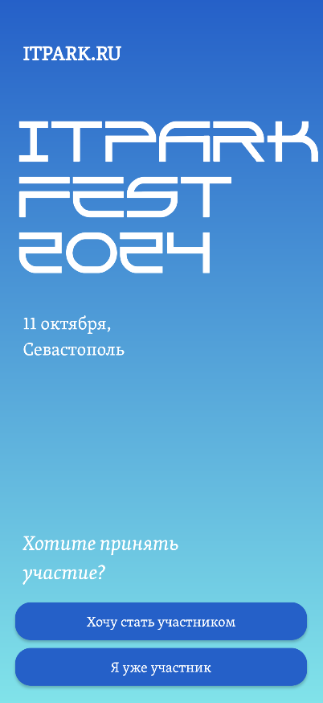
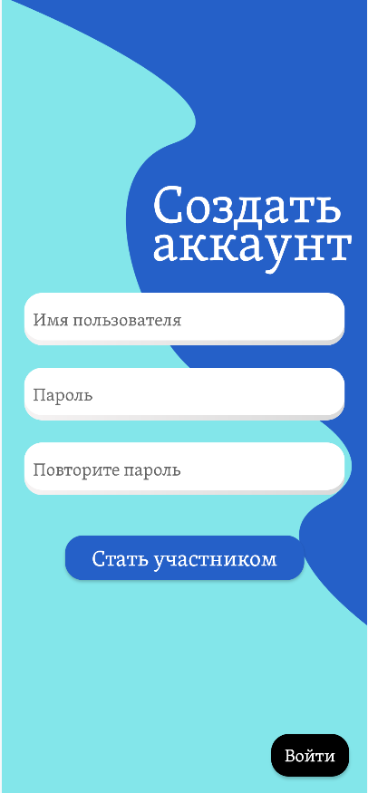
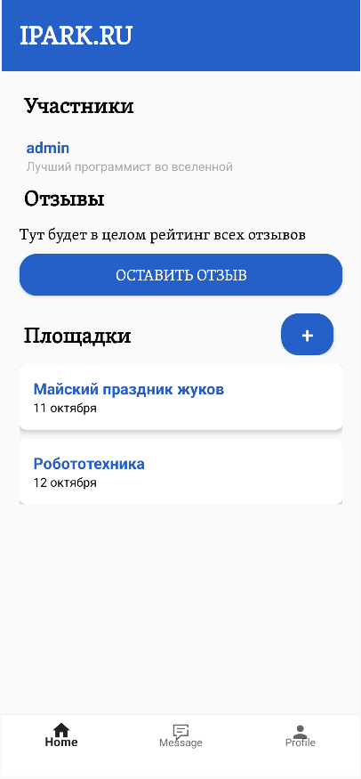
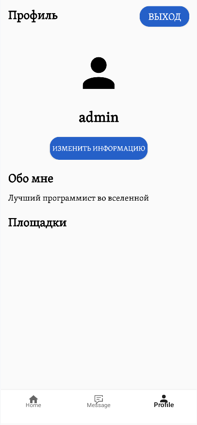
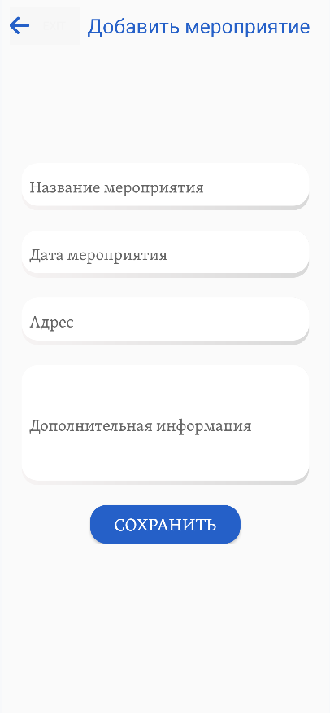

# ITPARK - Приложение для регистрации на IT-конференцию в Севастополе

Это учебный групповой проект.
ITPARK — это мобильное приложение, разработанное для упрощения выбора и регистрации на локальное IT-мероприятия, проходящие в Севастополе.
---
## Содержание

- [Описание](#описание)
- [Функциональные возможности](#функциональные-возможности)
- [Технические детали](#технические-детали)
- [Установка](#установка)
- [Этапы разработки](#этапы-разработки)
- [Участники разработки](#участники-разработки)
- [Скриншоты](#скриншоты)

## Описание

Приложение ITPARK создано для IT-специалистов, студентов и начинающих разработчиков, стремящихся повышать квалификацию и расширять свою сеть профессиональных контактов. Оно предлагает интуитивно понятный интерфейс для поиска и регистрации на мероприятия.

## Функциональные возможности

- Регистрация нового пользователя и вход в систему
- Запись на мероприятия
- Просмотр деталей мероприятий
- Управление мероприятиями для администраторов
- Управление информацией о аккаунте пользователя
- Оставление отзывов о мероприятиях

## Технические детали

- **Платформа:** Android
- **Язык программирования:** Kotlin
- **База данных:** SQLite
- **Паттерн проектирования:** DAO для взаимодействия с базой данных
- **Асинхронное выполнение задач:** Да
- **Обработка ошибок:** Да
- **Уведомления:** В зависимости от действий пользователя

## Установка

1. Клонируйте репозиторий:
   ```bash
   git clone https://github.com/Jonkambo/EventApp.git
   ```
2. Откройте проект в Android Studio.
3. Синхронизируйте проект с Gradle.
4. Запустите приложение на эмуляторе или реальном устройстве.

## Этапы разработки
1. Анализ действий и план
2. Проектирование интерфейса
3. Разработка функционала
4. Тестирование
5. Запуск приложения

## Участники-разработки
- Павел Панченко - капитан команды, отвечал за создание базы данных и вывод информации
- Анна Зарубина - разработчик, отвечала за верстку страниц, добавление площадок и вывод более подробной информации
- Алина Зарубина - разработчик, отвечала за стилизацию страниц, регистрацию участников и вывод их на экран
- Егор Шигаев и Дарья Левша - дизайнеры-разработчики, отвечали за дизайн продукта, переход между экранами и вход в приложение
- Сергей Бондарь - разработчик, отвечал за добавление отзывов в базу данных и вывод их на экран

## Скриншоты






